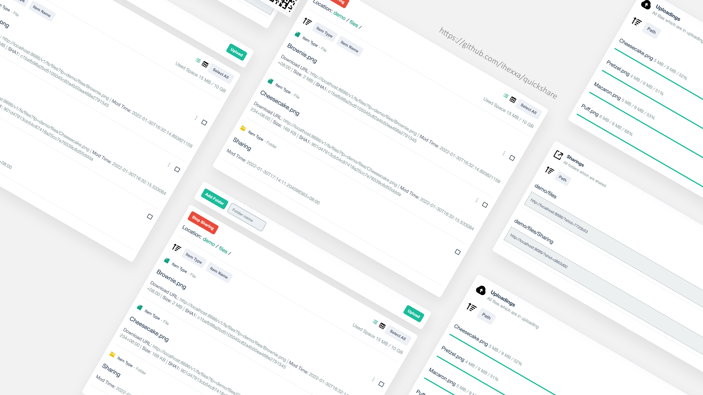

## Hiring

[The Insomnia Team](https://github.com/Kong/insomnia) is hiring more frontend and backend talents who is familar with React or Golang (**location**: Shanghai China).

Send your resume to me for quicker processing: **amlhLmhlQGtvbmdocS5jb20K**

*Detailed JDs can be found in the official site "Careers" page.*

## Highlights

**[Quickshare](https://github.com/ihexxa/quickshare)**: Simple file sharing service built with Go/Golang, Typescript, Gin, React, Boltdb, etc.

<!--
**ihexxa/ihexxa** is a ✨ _special_ ✨ repository because its `README.md` (this file) appears on your GitHub profile.

Here are some ideas to get you started:

- 🔭 I’m currently working on ...
- 🌱 I’m currently learning ...
- 👯 I’m looking to collaborate on ...
- 🤔 I’m looking for help with ...
- 💬 Ask me about ...
- 📫 How to reach me: ...
- 😄 Pronouns: ...
- ⚡ Fun fact: ...
-->
